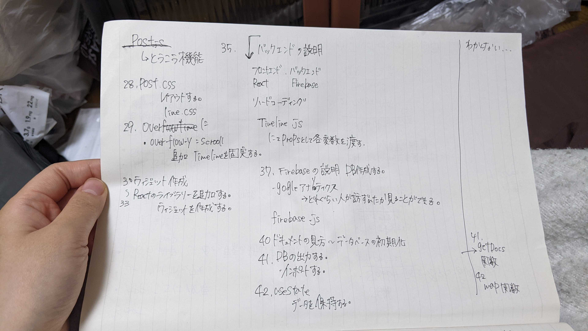

* わからないところ
  * getdocs 関数
  　Firebaseで使用する関数名
  * map 関数
  　配列のメソッド
  　配列を戻り値を返してくれることで、画面表示しやすくなる
  参考文献
  https://web.lingual-ninja.com/2020/05/react-array-map.html

* わからないところ
  * fooks
  　関数を使いまわすための機能